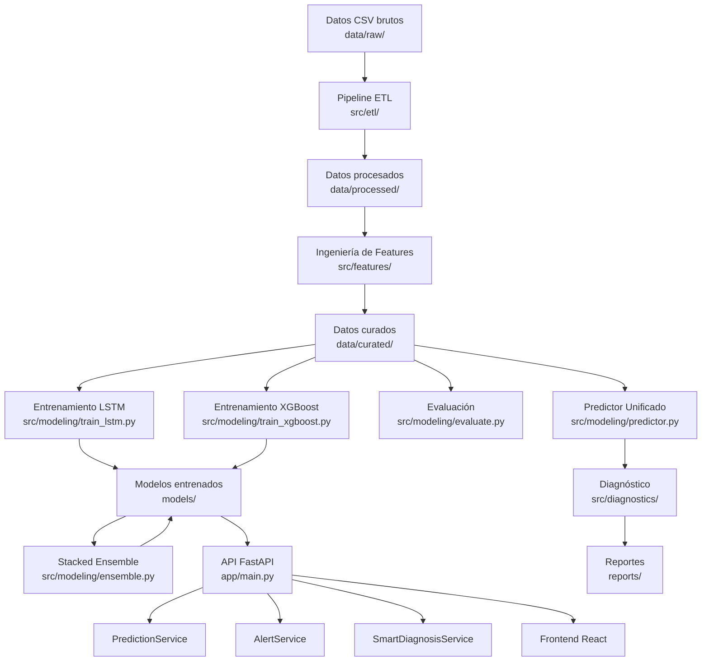
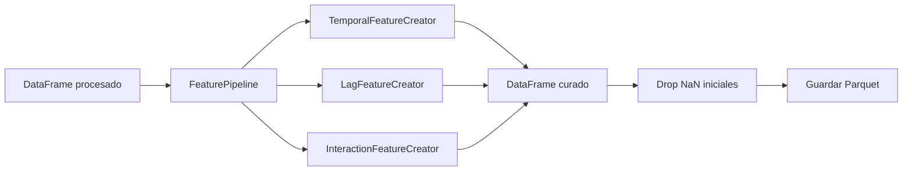
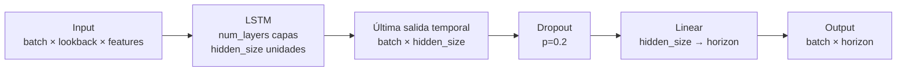
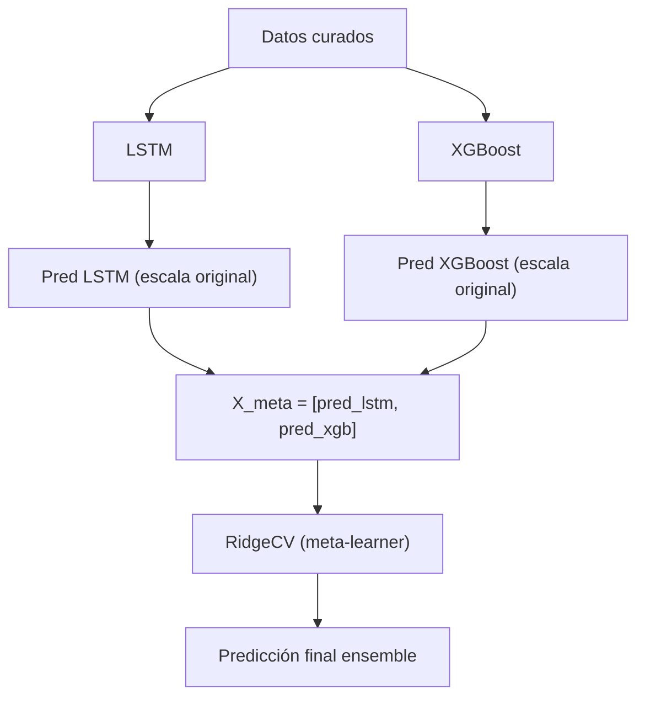
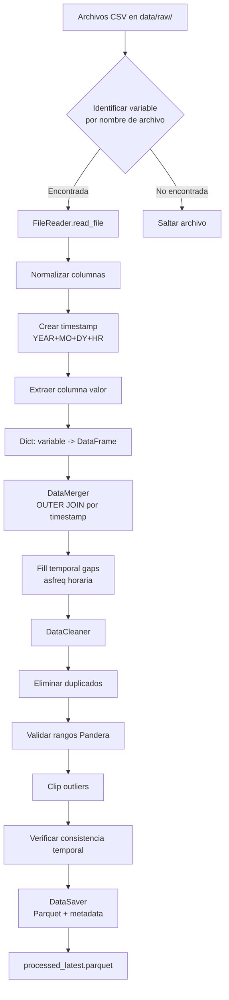
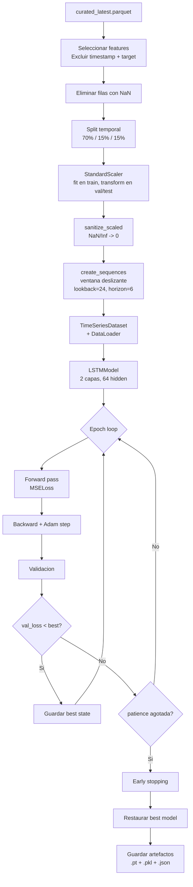
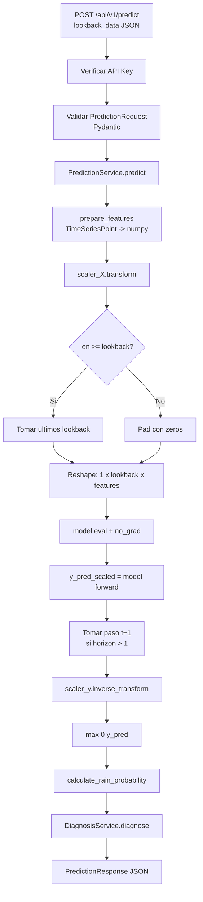
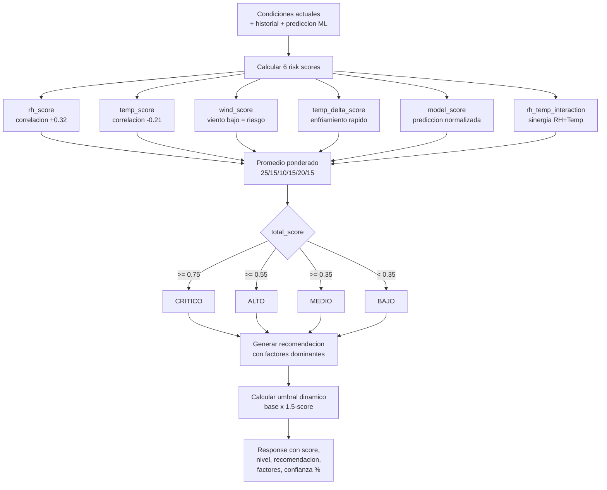
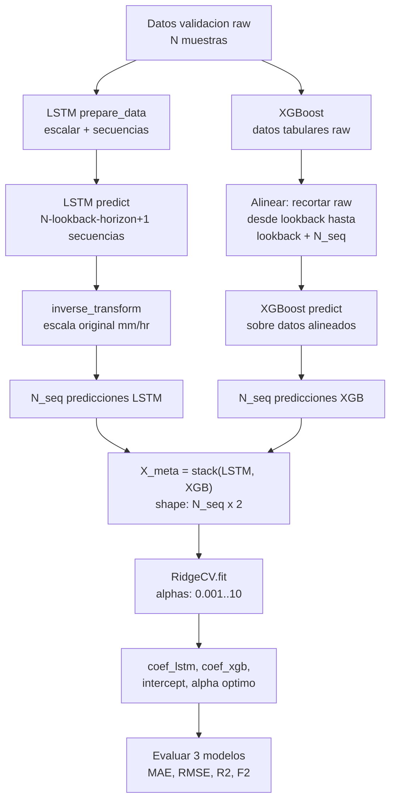

# Documentación Técnica — Sistema de Predicción de Precipitación IMA

**Versión:** 1.0.0  
**Última actualización:** Marzo 2026  
**Stack principal:** Python 3.9+ · PyTorch · XGBoost · FastAPI · scikit-learn · Pandas · Optuna

---

## Tabla de Contenidos

1. [Visión General del Sistema](#1-visión-general-del-sistema)
2. [Estructura del Proyecto](#2-estructura-del-proyecto)
3. [Pipeline ETL](#3-pipeline-etl-srcetl)
4. [Ingeniería de Features](#4-ingeniería-de-features-srcfeatures)
5. [Modelos de Machine Learning](#5-modelos-de-machine-learning-srcmodeling)
6. [Evaluación y Predicción](#6-evaluación-y-predicción)
7. [Sistema de Diagnóstico](#7-sistema-de-diagnóstico-srcdiagnostics)
8. [API REST](#8-api-rest-app)
9. [Servicios de la API](#9-servicios-de-la-api-appservices)
10. [Schemas y Validación](#10-schemas-y-validación-appschemas)
11. [Repositorios](#11-repositorios-apprepositories)
12. [CLI — Interfaz de Línea de Comandos](#12-cli--interfaz-de-línea-de-comandos)
13. [Configuración y Utilidades](#13-configuración-y-utilidades)
14. [Despliegue](#14-despliegue)
15. [Diagramas de Flujo de Algoritmos](#15-diagramas-de-flujo-de-algoritmos)

---

## 1. Visión General del Sistema

### 1.1 Descripción

IMA-Backend es un sistema integral de predicción meteorológica que combina modelos de machine learning (LSTM, XGBoost y Ensemble) con una API REST y un sistema de diagnóstico adaptativo para entregar pronósticos de precipitación. El sistema procesa datos meteorológicos crudos (CSV), los transforma mediante un pipeline ETL, genera features avanzadas, entrena y evalúa modelos, y expone predicciones a través de endpoints HTTP.

### 1.2 Arquitectura General



### 1.3 Stack Tecnológico

| Capa | Tecnologías |
|------|------------|
| **Modelos ML** | PyTorch (LSTM), XGBoost, scikit-learn (StandardScaler, RidgeCV) |
| **Optimización** | Optuna (TPESampler, MedianPruner) |
| **Pipeline de datos** | Pandas, NumPy, PyArrow (Parquet), Pandera (validación) |
| **API** | FastAPI, Uvicorn, Gunicorn, Pydantic v2, pydantic-settings |
| **Seguridad** | API Key (X-API-Key header), python-jose (JWT) |
| **Visualización** | Matplotlib, Seaborn |
| **Testing** | pytest, pytest-asyncio, pytest-cov, httpx |
| **Despliegue** | Docker, Nginx, docker-compose |
| **Configuración** | python-dotenv, archivos .env |

### 1.4 Flujo de Datos End-to-End

```
CSV (YEAR, MO, DY, HR, value)
    → Extract (auto-detección de variable por nombre de archivo)
    → Transform (merge por timestamp, limpieza, validación Pandera, fill gaps)
    → Load (Parquet + metadata JSON)
    → Feature Engineering (temporales cíclicos, lags, rolling, interacciones)
    → Train (LSTM secuencial + XGBoost tabular + Ensemble stacking)
    → Evaluate (MAE, RMSE, R², F1, F2, PR-AUC)
    → Predict (UnifiedPredictor / HybridPredictor)
    → Diagnose (motor de reglas meteorológicas → alertas)
    → API (FastAPI → JSON responses)
```

---

## 2. Estructura del Proyecto

```
IMA-Backend/
├── app/                          # API FastAPI
│   ├── __init__.py
│   ├── main.py                   # Punto de entrada, lifespan, middlewares, CORS
│   ├── core/                     # Infraestructura transversal
│   │   ├── config.py             # Settings (pydantic-settings, .env)
│   │   ├── exceptions.py         # Jerarquía de excepciones (APIException, ModelNotLoaded...)
│   │   ├── logging.py            # Logger estructurado con request_id
│   │   └── security.py           # Autenticación API Key
│   ├── repositories/             # Capa de acceso a artefactos
│   │   └── model_repository.py   # Carga de modelos .pt, .pkl, .json
│   ├── routers/                  # Endpoints REST
│   │   └── api_v1.py             # Todos los endpoints /api/v1/*
│   ├── schemas/                  # Modelos Pydantic (request/response)
│   │   ├── alerts.py             # AlertEvaluationRequest/Response
│   │   ├── alert_history.py      # AlertHistoryResponse
│   │   ├── health.py             # HealthResponse
│   │   ├── metrics.py            # MetricsResponse
│   │   ├── model.py              # ModelInfoResponse
│   │   ├── prediction.py         # PredictionRequest/Response, TimeSeriesPoint
│   │   └── subscription.py       # SubscriptionRequest/Response
│   └── services/                 # Lógica de negocio
│       ├── model_service.py      # Singleton: gestión modelo LSTM
│       ├── xgboost_service.py    # Gestión modelo XGBoost
│       ├── prediction_service.py # Predicción t+1 y multi-step
│       ├── alert_service.py      # Evaluación de alertas climáticas
│       ├── alert_history_service.py # Historial de alertas
│       ├── diagnosis_service.py  # Diagnóstico basado en reglas
│       ├── smart_diagnosis_service.py # Diagnóstico adaptativo con scores
│       ├── feature_utils.py      # Preparación de features para API
│       ├── metrics_service.py    # Métricas de rendimiento
│       └── subscription_service.py # Gestión de suscripciones
├── src/                          # Pipeline de datos y modelos
│   ├── __init__.py
│   ├── __main__.py               # Entry point: python -m src
│   ├── cli.py                    # CLI completo (argparse, 12 comandos)
│   ├── cleanup.py                # Limpieza de archivos generados
│   ├── etl/                      # Pipeline ETL
│   │   ├── extract.py            # DataExtractor, FileReader, VARIABLE_PATTERNS
│   │   ├── transform.py          # DataTransformer, DataMerger, DataCleaner
│   │   ├── load.py               # DataSaver (Parquet, CSV, JSON)
│   │   ├── consolidate.py        # Consolidación de múltiples fuentes
│   │   ├── validators.py         # Pandera schema, DataValidator, outlier cleaning
│   │   └── pipeline.py           # ETLPipeline (orquestador)
│   ├── features/                 # Ingeniería de características
│   │   ├── build_features.py     # Función principal build_features()
│   │   └── feature_engineering.py # FeaturePipeline, Temporal/Lag/Interaction creators
│   ├── modeling/                 # Modelos ML
│   │   ├── base.py               # BaseModel (ABC), DataPreparator
│   │   ├── train_lstm.py         # LSTMModel (nn.Module), entrenamiento, LSTMModelWrapper
│   │   ├── train_xgboost.py      # XGBRegressor, entrenamiento, XGBoostModelWrapper
│   │   ├── ensemble.py           # StackedEnsemble (RidgeCV meta-learner)
│   │   ├── evaluate.py           # Evaluación LSTM (regresión + clasificación)
│   │   ├── predictor.py          # UnifiedPredictor, HybridPredictor
│   │   ├── compare_models.py     # Comparación LSTM vs XGBoost
│   │   └── optuna_tune.py        # Búsqueda de hiperparámetros con Optuna
│   ├── diagnostics/              # Sistema de diagnóstico
│   │   ├── rules.py              # DiagnosticEngine, AlertLevel, reglas meteorológicas
│   │   └── recommender.py        # Recommender, generación de reportes
│   └── utils/                    # Utilidades compartidas
│       ├── config.py             # Config singleton (.env)
│       ├── hyperparams.py        # Carga de hiperparámetros desde JSON
│       ├── io.py                 # load_dataframe, save_dataframe, ensure_dir
│       ├── logging.py            # setup_logger (archivo + consola)
│       ├── sanitize.py           # sanitize_scaled (limpieza post-scaling)
│       └── seed.py               # set_global_seed (Python, NumPy, PyTorch)
├── configs/                      # Archivos de configuración
├── data/                         # Datos del proyecto
│   ├── raw/                      # CSVs meteorológicos originales
│   ├── processed/                # Datos procesados (Parquet)
│   ├── curated/                  # Datos con features ML (Parquet)
│   └── predictions/              # Resultados de predicciones
├── models/                       # Modelos entrenados y artefactos
├── reports/                      # Logs, gráficas, métricas
├── nginx/                        # Configuración Nginx
├── requirements.txt              # Dependencias Python
├── Dockerfile                    # Imagen Docker
├── docker-compose.yml            # Orquestación Docker
├── train.sh                      # Script de entrenamiento
├── deploy.sh                     # Script de despliegue
├── setup-ec2.sh                  # Script de configuración EC2
└── setup-duckdns.sh              # Script DuckDNS + SSL auto-firmado
```

---

## 3. Pipeline ETL (`src/etl/`)

El pipeline ETL procesa archivos CSV de estaciones meteorológicas y genera un dataset consolidado, limpio y validado en formato Parquet.

### 3.1 Orquestación — `ETLPipeline`

**Archivo:** `src/etl/pipeline.py`

La clase `ETLPipeline` orquesta las tres fases:

```python
class ETLPipeline:
    def run(self, fill_gaps=True, freq="H", archive_raw=True):
        extracted_data = self.extractor.extract_all()      # EXTRACT
        df_transformed = self.transformer.transform(...)    # TRANSFORM
        saved_paths = self.saver.save(...)                  # LOAD
```

**Parámetros configurables:**
- `fill_gaps`: Completar huecos temporales con NaN (default: `True`)
- `freq`: Frecuencia temporal de los datos (default: `"H"` = horaria)
- `archive_raw`: Mover archivos procesados a carpeta de archivo (default: `True`)

### 3.2 Extract — Extracción de Datos

**Archivo:** `src/etl/extract.py`

#### Algoritmo de identificación de variable

El sistema identifica automáticamente la variable meteorológica a partir del nombre del archivo CSV. Usa un mapeo de patrones con normalización Unicode:

```
VARIABLE_PATTERNS = {
    "precip":        ["precip", "precipitacion", "lluvia", "rain"],
    "rh_2m":         ["rh", "humedad", "humidity", "humedad relativa"],
    "temp_2m":       ["temp", "temperatura", "temperature"],
    "wind_speed_2m": ["velocidad del viento a 2 metros", ...],
    "wind_dir_2m":   ["direccion del viento a 2 metros", ...],
    "wind_speed_10m": [...],
    "wind_dir_10m":  [...]
}
```

**Normalización:** Se aplica `normalize_string()` que:
1. Convierte a minúsculas
2. Elimina tildes (NFD + filtrado de categoría Mn)
3. Elimina espacios, guiones bajos y guiones

**Mapeo final de variables:**

| Variable interna | Nombre final | Unidad |
|-----------------|-------------|--------|
| `precip` | `precip_mm_hr` | mm/hr |
| `rh_2m` | `rh_2m_pct` | % |
| `temp_2m` | `temp_2m_c` | °C |
| `wind_speed_2m` | `wind_speed_2m_ms` | m/s |
| `wind_dir_2m` | `wind_dir_2m_deg` | grados |
| `wind_speed_10m` | `wind_speed_10m_ms` | m/s |
| `wind_dir_10m` | `wind_dir_10m_deg` | grados |

#### Lectura de archivos — `FileReader`

Cada CSV de estación tiene la estructura:
- **Primeras 9 filas**: Metadatos de la estación (se saltan con `skip_rows=9`)
- **Columnas**: `YEAR, MO, DY, HR, value`
- **Delimitador**: `;` (auto-detección como fallback)

Flujo de procesamiento por archivo:
1. `_read_csv()` — Lectura con auto-detección de delimitador
2. `_normalize_columns()` — Nombres en minúscula y sin espacios
3. `_extract_temporal_columns()` — Identifica YEAR/MO/DY/HR por nombre o posición
4. `_create_timestamp()` — Genera columna `timestamp` como `datetime64`
5. `_extract_value_column()` — Extrae y renombra la columna de valor
6. `_clean_invalid_rows()` — Elimina filas con timestamp inválido

### 3.3 Transform — Transformación de Datos

**Archivo:** `src/etl/transform.py`

#### Merge de variables — `DataMerger`

Consolida múltiples DataFrames (uno por variable) mediante `outer join` sobre `timestamp`:

```
df_precip ──┐
df_rh ──────┤ OUTER JOIN on timestamp → DataFrame consolidado
df_temp ────┤                           (ordenado cronológicamente)
df_wind ────┘
```

#### Limpieza — `DataCleaner`

Secuencia de limpieza:
1. **Eliminación de duplicados** — `drop_duplicates(subset=["timestamp"], keep="first")`
2. **Validación de rangos** — Usa `DataValidator` con esquema Pandera
3. **Limpieza de outliers** — Método `clip` (recortar a rangos válidos) o `remove` (marcar como NaN)
4. **Consistencia temporal** — Detecta gaps mayores a 1 hora

#### Completado de gaps temporales

```python
def _fill_temporal_gaps(self, df, freq):
    df = df.set_index("timestamp").sort_index()
    df = df.asfreq(freq)  # Inserta filas con NaN para timestamps faltantes
    return df.reset_index()
```

Esto garantiza una serie temporal regular (frecuencia horaria) necesaria para las ventanas deslizantes del LSTM.

### 3.4 Validación — `DataValidator`

**Archivo:** `src/etl/validators.py`

#### Esquema Pandera

Se define un esquema tipado con rangos válidos para cada variable meteorológica:

| Variable | Tipo | Rango válido |
|----------|------|-------------|
| `timestamp` | DateTime | No nulo |
| `precip_mm_hr` | float | [0, 200] |
| `rh_2m_pct` | float | [0, 100] |
| `temp_2m_c` | float | [-40, 60] |
| `wind_speed_2m_ms` | float | [0, 100] |
| `wind_dir_2m_deg` | float | [0, 360] |
| `wind_speed_10m_ms` | float | [0, 100] |
| `wind_dir_10m_deg` | float | [0, 360] |

La validación usa `lazy=True` para recopilar todos los errores antes de reportar.

#### Limpieza de outliers

Dos estrategias disponibles:
- **`clip`** (default): Recorta valores al rango `[min, max]`
- **`remove`**: Marca valores fuera de rango como `NaN`

#### Resultado de validación — `ValidationResult`

```python
@dataclass
class ValidationResult:
    valid: bool
    errors: List[str]      # Errores críticos (fallan pipeline)
    warnings: List[str]    # Advertencias (no detienen pipeline)
    fixed_rows: int        # Filas corregidas
```

---

## 4. Ingeniería de Features (`src/features/`)

El módulo de features transforma datos meteorológicos procesados en un dataset enriquecido con características derivadas para alimentar los modelos ML.

### 4.1 Arquitectura del Pipeline

**Archivo:** `src/features/feature_engineering.py`

El pipeline usa un patrón Strategy con creadores modulares:



Todos los creadores implementan la interfaz `BaseFeatureCreator`:

```python
class BaseFeatureCreator(ABC):
    def create(self, df: pd.DataFrame) -> pd.DataFrame: ...
    def get_feature_names(self) -> List[str]: ...
```

### 4.2 Features Temporales — `TemporalFeatureCreator`

Genera features de calendario y representaciones cíclicas:

**Features básicos:**
- `hour_of_day` — Hora del día (0-23)
- `month` — Mes (1-12)
- `day_of_week` — Día de la semana (0=Lunes, 6=Domingo)
- `day_of_year` — Día del año (1-366)
- `is_weekend` — Binario (1 si sábado o domingo)

**Features cíclicos (codificación sin/cos):**

La codificación cíclica evita discontinuidades en variables periódicas. Para una variable `x` con periodo `P`:

```
x_sin = sin(2π · x / P)
x_cos = cos(2π · x / P)
```

| Feature | Periodo P | Propósito |
|---------|----------|-----------|
| `hour_sin`, `hour_cos` | 24 | Captura ciclo diurno |
| `month_sin`, `month_cos` | 12 | Captura estacionalidad anual |
| `dow_sin`, `dow_cos` | 7 | Captura patrón semanal |

### 4.3 Features de Lag y Rolling — `LagFeatureCreator`

Captura la memoria temporal de la precipitación:

**Lags (valores pasados):**

Configurables vía `.env` (default: `[1, 2, 3, 6, 12]`):
- `precip_mm_hr_lag_1` — Precipitación hace 1 hora
- `precip_mm_hr_lag_2` — Precipitación hace 2 horas
- ...hasta `precip_mm_hr_lag_12`

**Rolling statistics (estadísticas móviles):**

Configurables vía `.env` (default: ventanas `[3, 6]`):

Para cada ventana `w`:
- `precip_mm_hr_rolling_mean_{w}` — Media móvil de las últimas `w` horas
- `precip_mm_hr_rolling_std_{w}` — Desviación estándar móvil
- `precip_mm_hr_rolling_max_{w}` — Máximo en ventana
- `precip_mm_hr_rolling_min_{w}` — Mínimo en ventana

**Deltas (tasa de cambio):**
- `precip_mm_hr_delta_1h` — Cambio respecto a hace 1 hora: `precip(t) - precip(t-1)`
- `precip_mm_hr_delta_3h` — Cambio respecto a hace 3 horas
- `precip_mm_hr_delta_6h` — Cambio respecto a hace 6 horas

**Post-procesamiento:** Se eliminan las primeras `max(lags)` filas que contienen NaN por la operación de shift.

### 4.4 Features de Interacción — `InteractionFeatureCreator`

Genera features que capturan relaciones físicas entre variables meteorológicas:

| Feature | Fórmula | Significado físico |
|---------|---------|-------------------|
| `rh_temp_interaction` | `RH × Temp` | Interacción humedad-temperatura |
| `dewpoint_approx` | `Temp - (100 - RH) / 5` | Punto de rocío aproximado (fórmula simplificada de Magnus) |
| `calm_humid_index` | `(RH/100) × (1 / (wind + 0.1))` | Índice de calma húmeda: alto cuando hay humedad alta y viento bajo |
| `temp_2m_c_delta_2h` | `Temp(t) - Temp(t-2)` | Enfriamiento/calentamiento en 2 horas |
| `temp_2m_c_delta_6h` | `Temp(t) - Temp(t-6)` | Tendencia térmica de 6 horas |
| `wind_u_2m` | `-speed × sin(dir_rad)` | Componente zonal del viento (este-oeste) |
| `wind_v_2m` | `-speed × cos(dir_rad)` | Componente meridional del viento (norte-sur) |

**Descomposición vectorial del viento:**

La dirección del viento (0-360°) es una variable circular. Se descompone en componentes U y V usando convención meteorológica:

```
wind_u = -speed × sin(direction × π/180)   # Componente este-oeste
wind_v = -speed × cos(direction × π/180)   # Componente norte-sur
```

El signo negativo se debe a la convención meteorológica donde la dirección indica **de dónde viene** el viento.

---

## 5. Modelos de Machine Learning (`src/modeling/`)

### 5.1 Clase Base Abstracta — `BaseModel`

**Archivo:** `src/modeling/base.py`

Todos los modelos implementan la interfaz `BaseModel` (ABC):

```python
class BaseModel(ABC):
    def __init__(self, model_name: str):
        self.model_name = model_name
        self.model = None
        self.metadata = {}
        self.is_trained = False

    @abstractmethod
    def train(self, X_train, y_train, X_val, y_val, **kwargs) -> Dict
    @abstractmethod
    def predict(self, X) -> np.ndarray
    @abstractmethod
    def save(self, output_dir) -> Dict[str, Path]
    @abstractmethod
    def load(self, model_path, metadata_path=None)
    def evaluate(self, X_test, y_test, threshold=0.5) -> Dict[str, float]  # Implementado
```

El método `evaluate()` está implementado en la clase base y calcula:
- **Regresión:** MAE, RMSE, R², MAPE
- **Clasificación binaria:** Precision, Recall, F1, F2 (con umbral configurable)

Además provee `_save_metadata()` y `_load_metadata()` para persistencia de metadatos en JSON.

#### `DataPreparator` — Utilidad de Split Temporal

```python
class DataPreparator:
    @staticmethod
    def prepare_temporal_split(df, target_col, feature_cols=None,
                                train_split=0.7, val_split=0.15, test_split=0.15):
```

Realiza split **temporal** (no aleatorio) para respetar la causalidad de series temporales:

```
|← 70% Train →|← 15% Val →|← 15% Test →|
t₀                                        tₙ
```

### 5.2 Modelo LSTM

**Archivo:** `src/modeling/train_lstm.py`

#### Arquitectura — `LSTMModel`



**Implementación PyTorch:**

```python
class LSTMModel(nn.Module):
    def __init__(self, input_size, hidden_size=64, num_layers=2,
                 dropout=0.2, output_size=1):
        self.lstm = nn.LSTM(
            input_size=input_size,
            hidden_size=hidden_size,
            num_layers=num_layers,
            dropout=dropout if num_layers > 1 else 0,
            batch_first=True
        )
        self.dropout = nn.Dropout(dropout)
        self.fc = nn.Linear(hidden_size, output_size)

    def forward(self, x):
        lstm_out, _ = self.lstm(x)          # (batch, seq_len, hidden)
        last_out = lstm_out[:, -1, :]       # (batch, hidden) — último paso
        out = self.dropout(last_out)
        return self.fc(out)                 # (batch, horizon)
```

**Hiperparámetros por defecto:**

| Parámetro | Valor | Descripción |
|-----------|-------|-------------|
| `input_size` | Dinámico | Número de features del dataset curado |
| `hidden_size` | 64 | Neuronas por capa LSTM |
| `num_layers` | 2 | Capas LSTM apiladas |
| `dropout` | 0.2 | Tasa de dropout entre capas |
| `output_size` | 6 | Horizonte de predicción (horas) |
| `lookback` | 24 | Ventana de observación (horas) |

#### Algoritmo de Creación de Secuencias — Ventana Deslizante

**Función:** `create_sequences(X, y, lookback=24, horizon=6)`

Transforma datos tabulares en secuencias para el LSTM usando ventana deslizante:

```
Datos originales:  [x₀, x₁, x₂, ..., xₙ]

Secuencia 0:  X = [x₀ ... x₂₃]     →  y = [y₂₄ ... y₂₉]
Secuencia 1:  X = [x₁ ... x₂₄]     →  y = [y₂₅ ... y₃₀]
Secuencia 2:  X = [x₂ ... x₂₅]     →  y = [y₂₆ ... y₃₁]
...
Secuencia i:  X = [xᵢ ... xᵢ₊₂₃]   →  y = [yᵢ₊₂₄ ... yᵢ₊₂₉]
```

**Dimensiones resultantes:**
- `X_seq`: `(n_sequences, lookback, n_features)` = `(N-lookback-horizon+1, 24, F)`
- `y_seq`: `(n_sequences, horizon)` = `(N-lookback-horizon+1, 6)`

#### Preparación de Datos — `prepare_data()`

1. **Selección de features:** Todas las columnas excepto `timestamp` y `precip_mm_hr`
2. **Eliminación de NaN:** Filas con cualquier NaN en features o target
3. **Split temporal:** 70% train / 15% val / 15% test (cronológico)
4. **Escalado:** `StandardScaler` independiente para X e y
   - `scaler_X.fit_transform(X_train)` → `scaler_X.transform(X_val, X_test)`
   - `scaler_y.fit_transform(y_train)` → `scaler_y.transform(y_val, y_test)`
5. **Sanitización post-escalado:** `sanitize_scaled()` reemplaza NaN/Inf residuales por 0
6. **Creación de secuencias:** Aplica ventana deslizante a cada split

#### Algoritmo de Entrenamiento — `train_model()`

```
ENTRADA: data_dict, hiperparámetros
SALIDA:  modelo entrenado, historia

1.  Fijar semilla global (Python, NumPy, PyTorch)
2.  Detectar device (CUDA si disponible, sino CPU)
3.  Crear DataLoaders (train: shuffle=True, val: shuffle=False)
4.  Instanciar LSTMModel con arquitectura especificada
5.  Definir criterion = MSELoss(), optimizer = Adam(lr)
6.  Inicializar: best_val_loss = ∞, patience_counter = 0

7.  PARA epoch EN 1..epochs:
      # Fase de entrenamiento
      model.train()
      PARA cada batch (X, y) EN train_loader:
          y_pred = model(X)
          loss = MSE(y_pred, y)
          loss.backward()
          optimizer.step()

      # Fase de validación
      model.eval()
      val_loss = promedio(MSE) sobre val_loader

      # Early stopping
      SI val_loss < best_val_loss:
          best_val_loss = val_loss
          guardar state_dict como best_model_state
          patience_counter = 0
      SINO:
          patience_counter += 1
          SI patience_counter >= early_stopping_patience:
              BREAK

8.  Restaurar best_model_state
9.  RETORNAR modelo, historia
```

**Early stopping:** Detiene el entrenamiento si la pérdida de validación no mejora durante `patience` épocas consecutivas (default: 10). Restaura los pesos de la mejor época.

#### Artefactos Generados

| Archivo | Formato | Contenido |
|---------|---------|-----------|
| `lstm_{timestamp}.pt` | PyTorch state_dict | Pesos del modelo |
| `lstm_latest.pt` | PyTorch state_dict | Pesos del último modelo (symlink lógico) |
| `scaler.pkl` | Pickle | `{"scaler_X": StandardScaler, "scaler_y": StandardScaler}` |
| `lstm_metadata.json` | JSON | Arquitectura, hiperparámetros, historia, features |
| `data_dict.pkl` | Pickle | Splits de datos para evaluación posterior |

### 5.3 Modelo XGBoost

**Archivo:** `src/modeling/train_xgboost.py`

#### Algoritmo de Entrenamiento

A diferencia del LSTM, XGBoost trabaja con datos **tabulares** (sin secuencias):

```
1.  Cargar datos curados (Parquet)
2.  Separar features y target (precip_mm_hr)
3.  Split temporal: 70% train, 15% val, 15% test
4.  Crear XGBRegressor con hiperparámetros
5.  Entrenar con early_stopping_rounds=10 monitoreando RMSE en validación
6.  Evaluar en test set
7.  Generar gráfico de feature importance (top 20)
8.  Guardar modelo (.json) + metadata (.json)
```

**Hiperparámetros por defecto:**

| Parámetro | Valor | Descripción |
|-----------|-------|-------------|
| `n_estimators` | 200 | Número de árboles |
| `max_depth` | 6 | Profundidad máxima por árbol |
| `learning_rate` | 0.1 | Tasa de aprendizaje (shrinkage) |
| `subsample` | 0.8 | Fracción de muestras por árbol |
| `colsample_bytree` | 0.8 | Fracción de features por árbol |
| `min_child_weight` | 3 | Peso mínimo de hoja |
| `gamma` | 0.1 | Reducción mínima de pérdida para split |
| `reg_alpha` | 0.1 | Regularización L1 (Lasso) |
| `reg_lambda` | 1.0 | Regularización L2 (Ridge) |
| `objective` | `reg:squarederror` | Función objetivo de regresión |
| `eval_metric` | `rmse` | Métrica de evaluación |

#### Métricas de Evaluación

Se calculan métricas duales (regresión + clasificación binaria):

**Regresión:**
- **MAE** — Error absoluto medio: `mean(|y_true - y_pred|)`
- **RMSE** — Raíz del error cuadrático medio: `sqrt(mean((y_true - y_pred)²))`
- **R²** — Coeficiente de determinación: `1 - SS_res/SS_tot`
- **MAPE** — Error porcentual absoluto medio

**Clasificación binaria (evento de lluvia, umbral = 0.5 mm/hr):**
- **Precision** — TP / (TP + FP)
- **Recall** — TP / (TP + FN)
- **F1-Score** — Media armónica de Precision y Recall
- **F2-Score** — `(1 + β²) × (P × R) / (β² × P + R)` con β=2 (pondera Recall 2× más que Precision)
- **AUC-ROC** — Área bajo la curva ROC

> El F2-Score se usa como métrica principal porque en predicción de lluvia **es peor no detectar un evento (falso negativo) que dar una falsa alarma (falso positivo)**.

#### Artefactos Generados

| Archivo | Formato | Contenido |
|---------|---------|-----------|
| `xgboost_{timestamp}.json` | XGBoost JSON | Modelo serializado |
| `xgboost_latest.json` | XGBoost JSON | Último modelo |
| `xgboost_metadata.json` | JSON | Métricas, features, hiperparámetros |
| `xgboost_feature_importance.png` | PNG | Gráfico top 20 features |

### 5.4 Stacked Ensemble — Meta-Learner

**Archivo:** `src/modeling/ensemble.py`

#### Concepto

El ensemble combina las predicciones de LSTM y XGBoost mediante un meta-learner (RidgeCV) que aprende los pesos óptimos:



#### Algoritmo — `StackedEnsemble`

```
ENTRADA: DataFrame curado, modelos LSTM y XGBoost pre-entrenados
SALIDA:  Meta-modelo RidgeCV entrenado

1.  Cargar modelos base:
    - LSTM: lstm_latest.pt + scaler.pkl
    - XGBoost: xgboost_latest.json

2.  Preparar datos LSTM (escalado + secuencias) en split de validación

3.  Generar predicciones LSTM:
    - Predecir en X_val secuencias
    - Des-escalar con scaler_y.inverse_transform
    - Tomar solo paso t+1 si horizon > 1
    - Clamp >= 0

4.  Alinear XGBoost con LSTM:
    - LSTM secuencia i predice instante (i + lookback) del val raw
    - Recortar: X_xgb_aligned = X_val_raw[lookback : lookback + N_seq]
    - Generar predicciones XGBoost en datos alineados

5.  Construir meta-features:
    X_meta = [[lstm_pred₀, xgb_pred₀],
              [lstm_pred₁, xgb_pred₁],
              ...]

6.  Entrenar RidgeCV:
    - alphas = [0.001, 0.01, 0.1, 1.0, 10.0]
    - meta_model.fit(X_meta, y_true)
    - Obtener: alpha óptimo, coef_lstm, coef_xgb, intercept

7.  Evaluar los tres modelos en los mismos datos alineados
8.  Guardar ensemble_meta.pkl + ensemble_metadata.json
```

**Alineación temporal:** Es crucial que LSTM y XGBoost predigan exactamente los mismos instantes. El LSTM necesita `lookback` pasos previos, por lo que sus predicciones empiezan en `t = lookback`. Se recorta XGBoost para que opere sobre el mismo rango temporal.

#### Predicción en Producción

```python
def predict(self, X_lstm_seq, X_xgb_flat):
    y_pred_lstm = inverse_scale(lstm.predict(X_lstm_seq))  # (N,)
    y_pred_xgb = xgboost.predict(X_xgb_flat)              # (N,)
    X_meta = stack([y_pred_lstm, y_pred_xgb])              # (N, 2)
    return max(0, meta_model.predict(X_meta))              # (N,)
```

### 5.5 Optimización de Hiperparámetros — Optuna

**Archivo:** `src/modeling/optuna_tune.py`

#### Algoritmo de Búsqueda

Usa Optuna con TPE (Tree-structured Parzen Estimator) y pruning para encontrar hiperparámetros óptimos de ambos modelos simultáneamente:

```
ENTRADA: n_trials (default: 30), timeout opcional
SALIDA:  best_hyperparams.json

1.  Cargar datos curados
2.  Preparar datos para LSTM (secuencias) y XGBoost (tabulares)

3.  Crear estudio Optuna:
    - Sampler: TPESampler(seed=42)
    - Pruner: MedianPruner(n_startup_trials=5, n_warmup_steps=5)
    - Dirección: minimize

4.  PARA cada trial EN 1..n_trials:
      # Sugerir hiperparámetros LSTM
      hidden_size ∈ {32, 64, 128}
      num_layers ∈ [1, 3]
      dropout ∈ [0.0, 0.5] paso 0.1
      lr ∈ [1e-4, 1e-2] (log-uniform)
      batch_size ∈ {32, 64, 128}

      # Sugerir hiperparámetros XGBoost
      n_estimators ∈ [100, 500] paso 50
      max_depth ∈ [3, 10]
      learning_rate ∈ [0.01, 0.3] (log-uniform)
      subsample ∈ [0.6, 1.0]
      colsample_bytree ∈ [0.6, 1.0]
      min_child_weight ∈ [1, 10]
      gamma ∈ [0.0, 0.5]
      reg_alpha ∈ [0.0, 1.0]
      reg_lambda ∈ [0.5, 2.0]

      # Entrenar y evaluar
      lstm_rmse = entrenar_lstm(trial_params) → RMSE en escala original (mm/hr)
      xgb_rmse = entrenar_xgb(trial_params) → RMSE en validación

      # Objetivo combinado
      score = 0.5 × lstm_rmse + 0.5 × xgb_rmse

      # Pruning (abortar trials poco prometedores)
      SI trial.should_prune(): ABORTAR

5.  Guardar mejores hiperparámetros en configs/best_hyperparams.json
```

**Pruning:** El `MedianPruner` aborta trials cuyo rendimiento intermedio (cada época) es peor que la mediana de trials completados, ahorrando tiempo de cómputo.

---

## 6. Evaluación y Predicción

### 6.1 Evaluación del Modelo LSTM

**Archivo:** `src/modeling/evaluate.py`

#### Flujo de Evaluación

```
1.  Cargar artefactos: modelo .pt, scalers .pkl, metadata .json
2.  Reconstruir LSTMModel con arquitectura de metadata
3.  Cargar data_dict.pkl (splits originales del entrenamiento)
4.  Predecir en el split de TEST (15% final)
5.  Des-escalar predicciones y targets a escala original (mm/hr)
6.  Calcular métricas de regresión y clasificación
7.  Generar visualizaciones
8.  Guardar evaluation_results.json
```

#### Métricas Calculadas

**Regresión:**

| Métrica | Fórmula | Interpretación |
|---------|---------|----------------|
| MAE | `mean(\|y - ŷ\|)` | Error promedio absoluto en mm/hr |
| RMSE | `sqrt(mean((y - ŷ)²))` | Penaliza errores grandes |
| R² | `1 - Σ(y - ŷ)² / Σ(y - ȳ)²` | Varianza explicada (1.0 = perfecto) |
| MAPE | `mean(\|y - ŷ\| / y) × 100` | Error porcentual (excluye y=0) |

**Clasificación binaria (evento de lluvia):**

Se convierte la tarea de regresión en clasificación binaria con umbral configurable (`PRECIP_EVENT_MMHR`, default: 0.5 mm/hr):

| Métrica | Fórmula | Uso |
|---------|---------|-----|
| Precision | `TP / (TP + FP)` | ¿Cuántas alertas fueron reales? |
| Recall | `TP / (TP + FN)` | ¿Cuántos eventos reales detectamos? |
| F1-Score | `2 × (P × R) / (P + R)` | Balance precision-recall |
| F2-Score | `5 × (P × R) / (4P + R)` | **Métrica principal** — prioriza recall |
| PR-AUC | Área bajo curva Precision-Recall | Rendimiento global del clasificador |
| Confusion Matrix | `[[TN, FP], [FN, TP]]` | Desglose de aciertos/errores |

#### Visualizaciones Generadas

| Archivo | Contenido |
|---------|-----------|
| `predictions_test.png` | Serie temporal real vs predicha + scatter plot |
| `training_history.png` | Curvas de train loss y val loss por época |
| `pr_curve_test.png` | Curva Precision-Recall |

### 6.2 Predictor Unificado

**Archivo:** `src/modeling/predictor.py`

#### `UnifiedPredictor`

Abstrae la predicción para cualquier tipo de modelo:

```python
class UnifiedPredictor:
    def __init__(self, model_type: ModelType):  # LSTM, XGBOOST o HYBRID
    def load_model(self, model_dir=None):
    def predict(self, input_path=None, output_dir=None, save_results=True) -> pd.DataFrame
```

**Flujo de predicción LSTM:**
1. Cargar scalers y metadata
2. Extraer features del dataset curado
3. Escalar con `scaler_X.transform()`
4. Crear secuencias de ventana deslizante (sin horizon, solo lookback)
5. Predecir con el modelo
6. Des-escalar con `scaler_y.inverse_transform()`
7. Clamp a >= 0 (precipitación no puede ser negativa)

**Flujo de predicción XGBoost:**
1. Cargar metadata con nombres de features
2. Extraer features del dataset curado
3. Predecir directamente (XGBoost no necesita escalado ni secuencias)
4. Clamp a >= 0

#### `HybridPredictor`

Combina LSTM y XGBoost mediante promedio ponderado simple:

```python
class HybridPredictor:
    def __init__(self, w_lstm=0.5, w_xgboost=0.5):
    
    def predict_single(self, features_lstm, features_xgb):
        pred_lstm = lstm.predict(features_lstm)
        pred_xgb = xgboost.predict(features_xgb)
        return max(0, w_lstm × pred_lstm + w_xgboost × pred_xgb)
```

Los pesos son configurables desde `configs/hyperparameters.json` (sección `ensemble`).

### 6.3 Comparación de Modelos

**Archivo:** `src/modeling/compare_models.py`

Genera un reporte comparativo LSTM vs XGBoost evaluando ambos en el mismo test set con métricas idénticas (MAE, RMSE, R², F1, F2).

---

## 7. Sistema de Diagnóstico (`src/diagnostics/`)

El sistema de diagnóstico analiza condiciones meteorológicas y predicciones para generar alertas y recomendaciones operacionales.

### 7.1 Niveles de Alerta — `AlertLevel`

**Archivo:** `src/diagnostics/rules.py`

```python
class AlertLevel(Enum):
    BAJA = "baja"        # severity = 0
    MEDIA = "media"      # severity = 1
    ALTA = "alta"        # severity = 2
    CRITICA = "critica"  # severity = 3
```

### 7.2 Motor de Reglas — `DiagnosticEngine`

**Archivo:** `src/diagnostics/rules.py`

El motor evalúa cada registro aplicando 4 reglas basadas en correlaciones meteorológicas documentadas:

**Correlaciones de referencia:**
- Precipitación vs Humedad Relativa: **+0.32**
- Precipitación vs Temperatura: **-0.21**
- Humedad Relativa vs Temperatura: **-0.87**

#### Regla 1: RH Alta + Temperatura Descendente → Alerta ALTA

```
SI  rh_2m_pct >= RH_HIGH (90%)
Y   temp_delta_2h <= TEMP_DROP_2H (-0.5°C)
→   alert_level = ALTA
    regla = "RH_HIGH_TEMP_DROP"
```

**Justificación física:** Humedad relativa muy alta combinada con enfriamiento indica condensación activa y alta probabilidad de precipitación.

#### Regla 2: RH Media-Alta + Temperatura Descendente → Alerta MEDIA

```
SI  alert_level == BAJA (regla 1 no activada)
Y   rh_2m_pct >= RH_MEDIUM (85%)
Y   temp_delta_2h <= TEMP_DROP_2H (-0.5°C)
→   alert_level = MEDIA
    regla = "RH_MEDIUM_TEMP_DROP"
```

#### Regla 3: Viento Calmo + RH Alta → Escalación (+1 nivel)

```
SI  wind_speed_2m_ms <= WIND_CALM (1.0 m/s)
Y   rh_2m_pct >= RH_MEDIUM (85%)
→   alert_level = escalate(alert_level)
    regla = "WIND_CALM_RH_HIGH"
```

**Escalación:** BAJA→MEDIA, MEDIA→ALTA, ALTA→CRITICA, CRITICA→CRITICA

**Justificación:** Viento calmo impide dispersión de humedad, favoreciendo acumulación y condensación local.

#### Regla 4: Predicción Alta de Precipitación → Escalación

```
SI  precip_pred >= 2 × PRECIP_EVENT_MMHR (1.0 mm/hr)
→   SI alert_level < ALTA:
        alert_level = escalate(alert_level)
    regla = "HIGH_PRECIP_PRED"
```

#### Umbrales Configurables (`.env`)

| Variable | Default | Descripción |
|----------|---------|-------------|
| `RH_HIGH` | 90.0% | Umbral de humedad alta |
| `RH_MEDIUM` | 85.0% | Umbral de humedad media-alta |
| `TEMP_DROP_2H` | -0.5°C | Umbral de descenso térmico en 2 horas |
| `WIND_CALM_MS` | 1.0 m/s | Umbral de viento calmo |
| `PRECIP_EVENT_MMHR` | 0.5 mm/hr | Umbral de evento de precipitación |

### 7.3 Resultado de Diagnóstico — `DiagnosticResult`

```python
@dataclass
class DiagnosticResult:
    timestamp: str                              # ISO 8601
    alert_level: AlertLevel                     # Nivel de alerta resultante
    triggered_rules: List[str]                  # Reglas activadas con valores
    metrics: Dict[str, Optional[float]]         # rh, temp, wind, delta_temp
    precip_pred: float                          # Predicción (mm/hr, >= 0)
    precip_real: Optional[float]                # Valor real si disponible
```

### 7.4 Generador de Recomendaciones — `Recommender`

**Archivo:** `src/diagnostics/recommender.py`

#### Recomendaciones por Nivel

| Nivel | Prioridad | Descripción | Acciones clave |
|-------|-----------|-------------|---------------|
| **CRITICA** | 4 | Lluvia inminente con factores agravantes | Acción inmediata, protocolos de emergencia, suspender operaciones |
| **ALTA** | 3 | Lluvia probable en corto plazo | Asegurar drenajes, alertar personal, proteger equipos |
| **MEDIA** | 2 | Ambiente propenso a lluvia | Monitorear de cerca, preparar protocolos |
| **BAJA** | 1 | Sin señales fuertes | Monitoreo rutinario |

#### Determinación del Nivel General

```python
def _determine_overall_alert(summary, threshold_pct=5.0):
    # Si más del 5% de registros son CRITICA → nivel general CRITICA
    # Si más del 5% son ALTA → nivel general ALTA
    # Si más del 5% son MEDIA → nivel general MEDIA
    # Sino → BAJA
```

#### Reporte Generado

El reporte JSON incluye:
- **Metadata:** Timestamp, total de registros, periodo analizado
- **Resumen de alertas:** Conteo y porcentaje por nivel
- **Estadísticas de precipitación:** Media, máximo, eventos de lluvia
- **Reglas más frecuentes:** Top 5 reglas activadas
- **Nivel de alerta general:** Con descripción y acciones recomendadas
- **Top 10 registros más críticos:** Con timestamp, reglas y métricas

---

## 8. API REST (`app/`)

### 8.1 Punto de Entrada -- `app/main.py`

La aplicacion FastAPI se configura con:

1. **Lifespan (startup/shutdown):** Carga modelos LSTM y XGBoost al iniciar
2. **CORS Middleware:** Configurable via `ALLOWED_ORIGINS` (default: `*` en desarrollo)
3. **Request-ID Middleware:** Genera UUID por request, lo propaga en headers y logs
4. **Logging Middleware:** Registra metodo, path, cliente y status_code de cada request
5. **Exception Handlers:** Manejo centralizado de APIException, HTTPException y excepciones generales

```python
app = FastAPI(
    title="Precipitation Prediction API",
    version="1.0.0",
    lifespan=lifespan,
    docs_url="/api/v1/docs",
    redoc_url="/api/v1/redoc"
)
```

### 8.2 Configuracion -- `app/core/config.py`

Usa `pydantic-settings` con `BaseSettings` para cargar configuracion desde `.env`:

```python
class Settings(BaseSettings):
    model_config = SettingsConfigDict(env_file=".env", case_sensitive=False)
    
    # API
    api_key: str = "dev-key-change-in-production"
    api_prefix: str = "/api/v1"
    debug: bool = False
    
    # Modelos
    model_path: str = "models/lstm_latest.pt"
    scaler_path: str = "models/scaler.pkl"
    metadata_path: str = "models/lstm_metadata.json"
    lookback: int = 24
    horizon: int = 1
    
    # Umbrales de diagnostico
    rh_high: float = 90.0
    rh_medium: float = 85.0
    temp_drop_2h: float = -0.5
    wind_calm_ms: float = 1.0
    precip_event_mmhr: float = 0.5
    
    # Metricas y logging
    log_level: str = "INFO"
    log_format: str = "json"
    enable_metrics: bool = True
```

Se instancia como singleton con `@lru_cache()`:

```python
@lru_cache()
def get_settings() -> Settings:
    return Settings()
```

### 8.3 Seguridad -- `app/core/security.py`

Autenticacion mediante API Key en header HTTP:

```
Header requerido: X-API-Key: <valor>
```

```python
async def verify_api_key(api_key: str = Security(api_key_header)) -> str:
    if api_key is None:
        raise HTTPException(401, "API Key requerida")
    if api_key != settings.api_key:
        raise HTTPException(401, "API Key invalida")
    return api_key
```

Todos los endpoints protegidos usan `Depends(verify_api_key)`.

### 8.4 Jerarquia de Excepciones -- `app/core/exceptions.py`

```
Exception
  +-- APIException (500)
       +-- ModelNotLoadedException (503)
       +-- PredictionException (500)
       +-- ValidationException (422)
       +-- ResourceNotFoundException (404)
```

Cada excepcion produce una respuesta JSON estandarizada:

```json
{
    "error": "mensaje descriptivo",
    "details": {},
    "path": "/api/v1/predict"
}
```

### 8.5 Logging Estructurado -- `app/core/logging.py`

- **Formato:** JSON estructurado (configurable a texto plano)
- **Context variable:** `request_id_context` (ContextVar) para trazabilidad
- **Archivo de log:** `reports/api.log`
- **Nivel:** Configurable via `LOG_LEVEL` (default: INFO)

### 8.6 Endpoints

| Metodo | Ruta | Descripcion | Auth |
|--------|------|-------------|------|
| `GET` | `/api/v1/health` | Estado del servicio y modelos | No |
| `GET` | `/api/v1/model/info` | Metadatos de LSTM y XGBoost | Si |
| `POST` | `/api/v1/predict` | Prediccion t+1 con LSTM | Si |
| `POST` | `/api/v1/predict/xgboost` | Prediccion t+1 con XGBoost | Si |
| `POST` | `/api/v1/forecast` | Pronostico multi-paso (hasta horizon) | Si |
| `POST` | `/api/v1/diagnosis` | Diagnostico basado en reglas | Si |
| `POST` | `/api/v1/diagnosis/adaptive` | Diagnostico adaptativo con scores | Si |
| `POST` | `/api/v1/alerts/evaluate` | Evaluar alertas climaticas | Si |
| `GET` | `/api/v1/alerts/active` | Obtener alertas activas | Si |
| `GET` | `/api/v1/metrics` | Metricas de rendimiento | Si |

---

## 9. Servicios de la API (`app/services/`)

### 9.1 ModelService -- Gestion del Modelo LSTM

**Archivo:** `app/services/model_service.py`

Singleton que gestiona el ciclo de vida del modelo LSTM en la API:

```python
class ModelService:
    _instance = None      # Singleton
    _model: LSTMModel     # Modelo PyTorch
    _scalers: Dict        # {scaler_X, scaler_y}
    _metadata: Dict       # Arquitectura, features, lookback
    _loaded_at: datetime  # Timestamp de carga
```

**Metodos principales:**
- `load_model()` -- Carga modelo, scalers y metadata desde disco
- `reload_model()` -- Recarga sin reiniciar el servicio
- `is_loaded()` -- Verifica estado
- `get_model()` -- Retorna LSTMModel (raise si no cargado)
- `get_scalers()` -- Retorna scalers
- `get_feature_names()` -- Lista de features esperados
- `get_lookback()` -- Ventana lookback configurada
- `get_lstm_info()` -- Info completa (arquitectura + metricas de evaluacion)
- `get_xgboost_info()` -- Info del modelo XGBoost

### 9.2 PredictionService -- Prediccion en Tiempo Real

**Archivo:** `app/services/prediction_service.py`

#### Prediccion t+1 -- `predict()`

```
ENTRADA: lookback_data (lista de TimeSeriesPoint)
SALIDA:  (prediccion_mm_hr, probabilidad_evento)

1.  Preparar features desde TimeSeriesPoint:
    - Extraer rh_2m_pct, temp_2m_c, wind_speed_2m_ms, wind_dir_2m_deg
    - Calcular features derivados (sin/cos hora, lags, etc.)
    
2.  Escalar con scaler_X del modelo cargado

3.  Pad/truncate a ventana lookback:
    - Si len < lookback: pad con zeros al inicio
    - Si len >= lookback: tomar ultimos lookback puntos
    
4.  Reshape a tensor: (1, lookback, n_features)

5.  Inferencia:
    model.eval()
    with torch.no_grad():
        y_pred_scaled = model(X_seq)  # (1, horizon)
    
6.  Des-escalar primer paso (t+1):
    y_pred = scaler_y.inverse_transform(y_pred_scaled[:, 0:1])
    y_pred = max(0, y_pred)

7.  Calcular probabilidad de evento de lluvia:
    rain_prob = sigmoid-like basado en umbral
    
8.  RETORNAR (y_pred, rain_prob)
```

#### Prediccion Multi-step -- `predict_multistep()`

Igual que t+1 pero retorna todos los pasos del horizonte:

```python
results = []
for step in range(horizon):
    y_val = scaler_y.inverse_transform(y_pred_scaled[:, step:step+1])
    y_val = max(0, y_val)
    rain_prob = calculate_rain_probability(y_val)
    results.append((y_val, rain_prob))
```

### 9.3 AlertService -- Alertas Climaticas

**Archivo:** `app/services/alert_service.py`

Evalua condiciones meteorologicas individuales y combinadas para generar alertas en tiempo real.

#### Umbrales de Alerta

| Variable | Nivel MEDIO | Nivel ALTO |
|----------|------------|------------|
| Humedad relativa | >= 80% | >= 90% |
| Temperatura baja | <= 10 C | <= 5 C |
| Temperatura alta | >= 30 C | >= 35 C |
| Velocidad viento | >= 10 m/s | >= 15 m/s |
| Delta temperatura | >= 3 C | >= 5 C |
| Delta humedad | >= 15% | >= 25% |

#### Evaluacion de Condiciones Combinadas

Detecta patrones de riesgo compuesto:

**Patron 1: Condiciones optimas para precipitacion**
```
SI  rh >= 85% Y 15 <= temp <= 25 C Y wind < 2 m/s
->  Alerta ALTO (condiciones ideales para lluvia)
```

**Patron 2: Calma con humedad extrema**
```
SI  rh >= 90% Y wind < 1 m/s
->  Alerta CRITICO (emergencia climatica)
```

#### Intervalos de Actualizacion por Nivel

| Nivel | Intervalo |
|-------|----------|
| Bajo | 24 horas |
| Medio | 12 horas |
| Alto | 3 horas |
| Critico | 30 minutos |

### 9.4 SmartDiagnosisService -- Diagnostico Adaptativo

**Archivo:** `app/services/smart_diagnosis_service.py`

Sistema de diagnostico avanzado que reemplaza umbrales fijos por scores ponderados basados en correlaciones meteorologicas conocidas.

#### Algoritmo de Calculo de Risk Score

```
ENTRADA: condiciones actuales, historial previo, prediccion del modelo
SALIDA:  scores por factor, nivel de alerta, recomendacion

1.  Calcular scores individuales (cada uno en [0, 1]):

    rh_score = clip(normalize(rh) * 0.32, 0, 1)
        # Basado en correlacion precip-rh = +0.32

    temp_score = clip(-normalize(temp) * 0.21, 0, 1)
        # Basado en correlacion precip-temp = -0.21

    wind_score = clip(1 - wind/wind_mean, 0, 1)
        # Viento bajo = score alto

    temp_delta_score = clip(-temp_delta_2h / 5.0, 0, 1)
        # Enfriamiento rapido = score alto

    model_score = clip(predicted_precip / precip_mean, 0, 1)
        # Prediccion del modelo normalizada

    rh_temp_interaction = clip((rh_high + temp_low) / 2, 0, 1)
        # Sinergia RH alta + Temp baja

2.  Calcular score total (promedio ponderado):

    total_score = 0.25 * rh_score        # Humedad: 25%
                + 0.15 * temp_score       # Temperatura: 15%
                + 0.10 * wind_score       # Viento: 10%
                + 0.15 * temp_delta_score # Cambios rapidos: 15%
                + 0.20 * model_score      # Prediccion ML: 20%
                + 0.15 * rh_temp_interaction  # Sinergia: 15%

3.  Determinar nivel de alerta:
    total >= 0.75 -> CRITICO
    total >= 0.55 -> ALTO
    total >= 0.35 -> MEDIO
    total <  0.35 -> BAJO

4.  Generar recomendacion adaptativa con factores dominantes
```

#### Umbral Dinamico

El umbral de evento de lluvia se ajusta segun las condiciones:

```python
def get_dynamic_threshold(self, current, previous):
    base = settings.precip_event_mmhr  # 0.5 mm/hr
    total_score = weighted_sum(scores)
    adjustment = 1.5 - total_score     # Score 0 -> x1.5, Score 1 -> x0.5
    return clip(base * adjustment, 0.3, 10.0)
```

Cuando las condiciones son propicias (score alto), el umbral se reduce, haciendo el sistema mas sensible.

### 9.5 Otros Servicios

| Servicio | Archivo | Responsabilidad |
|----------|---------|----------------|
| `XGBoostService` | `xgboost_service.py` | Singleton para gestion de modelo XGBoost |
| `DiagnosisService` | `diagnosis_service.py` | Diagnostico basado en reglas (wrapper de `src/diagnostics`) |
| `MetricsService` | `metrics_service.py` | Metricas de rendimiento de la API (latencia, contadores) |
| `AlertHistoryService` | `alert_history_service.py` | Historial de alertas en memoria |
| `SubscriptionService` | `subscription_service.py` | Gestion de suscripciones a alertas |
| `FeatureUtils` | `feature_utils.py` | Preparacion de features compartida entre servicios |

---

## 10. Schemas y Validacion (`app/schemas/`)

Modelos Pydantic v2 para validacion de requests y responses.

### 10.1 Schemas de Prediccion -- `prediction.py`

**`TimeSeriesPoint`** -- Punto de datos meteorologicos:

```python
class TimeSeriesPoint(BaseModel):
    timestamp: datetime
    rh_2m_pct: float        # Humedad relativa (%)
    temp_2m_c: float        # Temperatura (C)
    wind_speed_2m_ms: float # Velocidad del viento (m/s)
    wind_dir_2m_deg: float  # Direccion del viento (grados)
```

**`PredictionRequest`** -- Request de prediccion:

```python
class PredictionRequest(BaseModel):
    lookback_data: List[TimeSeriesPoint]  # Ventana de observacion
```

**`PredictionResponse`** -- Response de prediccion:

```python
class PredictionResponse(BaseModel):
    prediction_mm_hr: float     # Precipitacion predicha
    rain_event_prob: float      # Probabilidad de evento [0, 1]
    diagnosis: Dict             # Diagnostico asociado
    latency_ms: float           # Tiempo de inferencia
    timestamp: datetime         # Timestamp de la prediccion
```

**`AlertLevel`** (API) -- Enum con colores:

```python
class AlertLevel(str, Enum):
    BAJO = "bajo"        # color: #22c55e (verde)
    MEDIO = "medio"      # color: #eab308 (amarillo)
    ALTO = "alto"        # color: #f97316 (naranja)
    CRITICO = "critico"  # color: #ef4444 (rojo)
```

### 10.2 Otros Schemas

| Schema | Archivo | Campos principales |
|--------|---------|-------------------|
| `HealthResponse` | `health.py` | status, models_loaded, uptime, version |
| `ModelInfoResponse` | `model.py` | lstm_info, xgboost_info, architecture, metrics |
| `AlertEvaluationRequest` | `alerts.py` | current (TimeSeriesPoint), previous (List) |
| `MetricsResponse` | `metrics.py` | total_predictions, avg_latency, error_rate |
| `SubscriptionRequest` | `subscription.py` | email, alert_levels, variables |
| `AlertHistoryResponse` | `alert_history.py` | alerts, total, filtered_by |

---

## 11. Repositorios (`app/repositories/`)

### 11.1 ModelRepository

**Archivo:** `app/repositories/model_repository.py`

Capa de abstraccion para acceso a artefactos de modelos en disco:

```python
class ModelRepository:
    def load_model_state(self) -> dict:
        # Carga state_dict desde models/lstm_latest.pt
        return torch.load(path, map_location="cpu")
    
    def load_scaler(self) -> dict:
        # Carga scalers desde models/scaler.pkl
        with open(path, "rb") as f:
            return pickle.load(f)  # {"scaler_X": ..., "scaler_y": ...}
    
    def load_metadata(self) -> dict:
        # Carga metadata desde models/lstm_metadata.json
        with open(path, "r") as f:
            return json.load(f)
```

Se instancia como singleton via `get_model_repository()`. Los paths se resuelven desde `Settings` (configuracion centralizada).

---

## 12. CLI -- Interfaz de Linea de Comandos

**Archivo:** `src/cli.py`

### 12.1 Arquitectura

El CLI usa `argparse` con subparsers. Cada comando se implementa como funcion `cmd_*(args)` envuelta en `execute_command()` para manejo de errores estandarizado.

### 12.2 Comandos Disponibles

| Comando | Funcion | Descripcion |
|---------|---------|-------------|
| `etl` | `cmd_etl` | Pipeline ETL completo |
| `features` | `cmd_features` | Construccion de features |
| `train-lstm` | `cmd_train_lstm` | Entrenamiento LSTM |
| `train-xgboost` | `cmd_train_xgboost` | Entrenamiento XGBoost |
| `eval-lstm` | `cmd_eval_lstm` | Evaluacion LSTM en test set |
| `compare` | `cmd_compare` | Comparacion LSTM vs XGBoost |
| `predict` | `cmd_predict` | Predicciones con LSTM |
| `predict-xgboost` | `cmd_predict_xgboost` | Predicciones con XGBoost |
| `tune` | `cmd_tune` | Busqueda de hiperparametros (Optuna) |
| `diagnose` | `cmd_diagnose` | Diagnostico y recomendaciones |
| `cleanup` | `cmd_cleanup` | Limpieza de archivos generados |
| `all` | `cmd_all` | Pipeline completo (todos los pasos) |

### 12.3 Pipeline Completo (`all`)

Ejecuta los pasos secuencialmente. Si alguno falla, el pipeline se detiene:

```
ETL -> Features -> Train LSTM -> Train XGBoost -> Eval LSTM
    -> Compare Models -> Predict LSTM -> Predict XGBoost -> Diagnose
```

### 12.4 Argumentos del CLI

**Argumentos de `train-lstm`:**

| Argumento | Default | Fuente | Descripcion |
|-----------|---------|--------|-------------|
| `--hidden` | 64 | hyperparameters.json | Tamano capa oculta |
| `--layers` | 2 | hyperparameters.json | Capas LSTM |
| `--dropout` | 0.2 | hyperparameters.json | Tasa dropout |
| `--lr` | 0.001 | hyperparameters.json | Learning rate |
| `--epochs` | 50 | hyperparameters.json | Epocas maximas |
| `--batch` | 64 | hyperparameters.json | Tamano batch |
| `--lookback` | 24 | hyperparameters.json | Ventana observacion |
| `--horizon` | 6 | hyperparameters.json | Horizonte prediccion |
| `--early-stopping` | 10 | hyperparameters.json | Paciencia early stopping |
| `--seed` | 42 | hyperparameters.json | Semilla reproducibilidad |
| `--train-split` | 0.7 | Fijo | Proporcion train |
| `--val-split` | 0.15 | Fijo | Proporcion validacion |
| `--test-split` | 0.15 | Fijo | Proporcion test |

Los defaults se cargan desde `configs/hyperparameters.json` si existe, con fallback a valores hardcoded.

**Argumentos de `tune`:**

| Argumento | Default | Descripcion |
|-----------|---------|-------------|
| `--trials` | 30 | Numero de trials Optuna |
| `--timeout` | None | Timeout en segundos |
| `--seed` | 42 | Semilla |

---

## 13. Configuracion y Utilidades

### 13.1 Configuracion del Pipeline -- `src/utils/config.py`

Singleton que carga variables de entorno desde `.env` usando `python-dotenv`:

```python
class Config:
    _instance = None  # Singleton via __new__

    def __init__(self):
        project_root = Path(__file__).parent.parent.parent
        load_dotenv(project_root / ".env")
```

**Propiedades principales:**

| Propiedad | Default | Variable .env |
|-----------|---------|--------------|
| `raw_data_dir` | `data/raw` | `RAW_DATA_DIR` |
| `processed_data_dir` | `data/processed` | `PROCESSED_DATA_DIR` |
| `curated_data_dir` | `data/curated` | `CURATED_DATA_DIR` |
| `predictions_dir` | `data/predictions` | `PREDICTIONS_DIR` |
| `models_dir` | `models` | `MODELS_DIR` |
| `reports_dir` | `reports` | `REPORTS_DIR` |
| `hidden_size` | 64 | `HIDDEN_SIZE` |
| `num_layers` | 2 | `NUM_LAYERS` |
| `dropout` | 0.2 | `DROPOUT` |
| `learning_rate` | 0.001 | `LEARNING_RATE` |
| `epochs` | 50 | `EPOCHS` |
| `batch_size` | 64 | `BATCH_SIZE` |
| `lookback` | 24 | `LOOKBACK` |
| `horizon` | 1 | `HORIZON` |
| `lags` | [1,2,3,6,12] | `LAGS` |
| `rolling_windows` | [3,6] | `ROLLING_WINDOWS` |

> **Nota:** Existen dos sistemas de configuracion paralelos:
> - `src/utils/config.py` (Config) -- Para el pipeline de datos/ML (usa python-dotenv)
> - `app/core/config.py` (Settings) -- Para la API FastAPI (usa pydantic-settings)
> Ambos leen del mismo archivo `.env` pero con mecanismos diferentes.

### 13.2 Hiperparametros -- `src/utils/hyperparams.py`

Carga hiperparametros desde `configs/hyperparameters.json` con fallback a valores por defecto:

```python
def get_lstm_defaults() -> dict:
    path = Path("configs/hyperparameters.json")
    if path.exists():
        with open(path) as f:
            return json.load(f)
    return {
        "hidden_size": 64, "num_layers": 2, "dropout": 0.2,
        "learning_rate": 0.001, "epochs": 50, "batch_size": 64,
        "lookback": 24, "horizon": 6, "early_stopping_patience": 10, "seed": 42
    }
```

Este archivo se actualiza automaticamente por `optuna_tune.py` al encontrar mejores hiperparametros.

### 13.3 Reproducibilidad -- `src/utils/seed.py`

Fija semillas globales en todos los generadores de numeros aleatorios:

```python
def set_global_seed(seed: int = 42):
    random.seed(seed)               # Python stdlib
    np.random.seed(seed)            # NumPy
    torch.manual_seed(seed)         # PyTorch CPU
    torch.cuda.manual_seed(seed)    # PyTorch CUDA
    torch.cuda.manual_seed_all(seed)# PyTorch multi-GPU
    torch.backends.cudnn.deterministic = True  # cuDNN determinista
    torch.backends.cudnn.benchmark = False     # Desactiva auto-tuning
    os.environ["PYTHONHASHSEED"] = str(seed)   # Hash de Python
```

### 13.4 Logging -- `src/utils/logging.py`

Sistema de logging con soporte para JSON estructurado y rotacion de archivos:

**JsonFormatter** produce logs como:
```json
{
    "timestamp": "2026-03-12T22:30:00",
    "level": "INFO",
    "logger": "modeling.train_lstm",
    "message": "Epoch [5/50] - Train Loss: 0.001234",
    "module": "train_lstm",
    "function": "train_model",
    "line": 348
}
```

**Rotacion:** Archivos de max 10MB con 5 backups (`RotatingFileHandler`).

### 13.5 I/O -- `src/utils/io.py`

Utilidades de entrada/salida:
- `load_dataframe(path)` -- Carga Parquet o CSV automaticamente segun extension
- `save_dataframe(df, path, format)` -- Guarda en Parquet, CSV o JSON
- `ensure_dir(path)` -- Crea directorio si no existe

### 13.6 Sanitizacion -- `src/utils/sanitize.py`

```python
def sanitize_scaled(X: np.ndarray) -> np.ndarray:
    # Reemplaza NaN e Inf residuales post-escalado con 0
    X = np.nan_to_num(X, nan=0.0, posinf=0.0, neginf=0.0)
    return X
```

Necesario porque `StandardScaler` puede producir NaN/Inf si una feature tiene varianza 0 en el conjunto de entrenamiento.

---

## 14. Despliegue

### 14.1 Docker

**Dockerfile:**
- Base: `python:3.11-slim`
- Dependencias del sistema: `gcc`, `g++`, `curl`
- Copia solo `app/` y `src/` (no datos ni modelos)
- Crea directorios para volumenes: `models/`, `data/`, `reports/`
- Comando: Gunicorn con 4 workers UvicornWorker en puerto 8000
- Timeout: 300 segundos (para inferencia LSTM)

**docker-compose.yml:**

```
services:
  backend:
    - Puerto 8000 (interno)
    - Volumenes: ~/models, ~/data, ~/reports
    - Healthcheck: GET /api/v1/health cada 30s
    - Variables de entorno desde .env

  nginx:
    - Puertos 80/443 (externo)
    - Reverse proxy a backend:8000
    - SSL/TLS con certificados montados
    - Depende de backend
```

Arquitectura de red:

```
Internet --> Nginx (80/443) --> Backend (8000) --> Modelos (disco)
```

### 14.2 Scripts de Despliegue

| Script | Proposito |
|--------|----------|
| `deploy.sh` | Despliegue general (build + up) |
| `setup-ec2.sh` | Configuracion de instancia EC2 (Docker, permisos, directorios) |
| `setup-duckdns.sh` | Configuracion DuckDNS (DNS dinamico + cron + SSL auto-firmado + nginx) |
| `train.sh` | Entrenamiento completo del pipeline en servidor |

### 14.3 Variables de Entorno de Produccion

```env
# API
API_KEY=<clave-segura-generada>
DEBUG=false
LOG_LEVEL=WARNING
ENVIRONMENT=production

# CORS
ALLOWED_ORIGINS=https://ima.up.railway.app

# Modelos (paths dentro del contenedor)
MODEL_PATH=models/lstm_latest.pt
SCALER_PATH=models/scaler.pkl
METADATA_PATH=models/lstm_metadata.json
```

---

## 15. Diagramas de Flujo de Algoritmos

### 15.1 Pipeline ETL Completo



### 15.2 Entrenamiento LSTM



### 15.3 Prediccion en Tiempo Real via API



### 15.4 Sistema de Diagnostico Adaptativo



### 15.5 Stacked Ensemble -- Alineacion Temporal



---

## Apendice: Dependencias del Proyecto

**`requirements.txt`:**

| Paquete | Version | Uso |
|---------|---------|-----|
| `torch` | 2.10.0 | Modelo LSTM |
| `xgboost` | 3.0.5 | Modelo XGBoost |
| `scikit-learn` | 1.7.2 | Scalers, metricas, RidgeCV |
| `pandas` | 2.3.3 | Manipulacion de datos |
| `numpy` | 2.3.3 | Operaciones numericas |
| `fastapi` | 0.110.0 | Framework API |
| `uvicorn` | 0.37.0 | Servidor ASGI |
| `gunicorn` | 23.0.0 | Servidor produccion |
| `pydantic` | 2.12.5 | Validacion de datos |
| `pydantic-settings` | 2.13.1 | Configuracion desde .env |
| `pandera` | 0.29.0 | Validacion de DataFrames |
| `optuna` | 4.7.0 | Optimizacion hiperparametros |
| `matplotlib` | 3.10.6 | Graficas |
| `seaborn` | 0.13.2 | Graficas estadisticas |
| `pyarrow` | 23.0.1 | Formato Parquet |
| `python-dotenv` | 1.1.1 | Variables de entorno |
| `python-jose` | 3.5.0 | JWT (preparado para uso futuro) |
| `httpx` | 0.28.1 | Cliente HTTP async |
| `pytest` | 8.4.2 | Testing |
| `pytest-asyncio` | 1.2.0 | Tests async |
| `pytest-cov` | 7.0.0 | Cobertura de tests |
| `requests` | 2.32.5 | Cliente HTTP sync |
| `Flask` | 3.1.2 | Utilidades adicionales |

