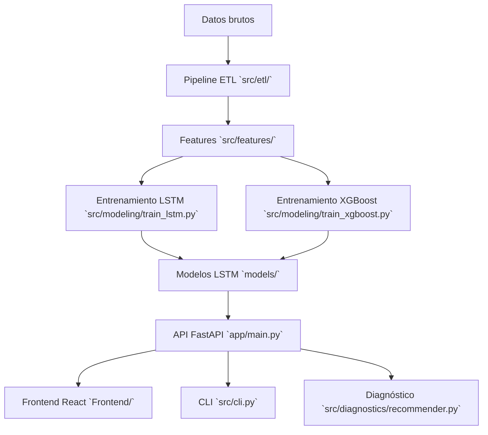

# 🌧️ Sistema de Predicción de Precipitación - IMA

Sistema integral de predicción meteorológica que combina machine learning (LSTM + XGBoost), API REST y frontend web interactivo para entregar pronósticos de lluvia en tiempo real.

## 🚀 Características Principales

- **🧠 Modelos ML**: LSTM y XGBoost para predicción de precipitación
- **⚡ API REST**: FastAPI con endpoints completos para integración
- **💬 Frontend Interactivo**: Interfaz tipo chat con React + Vite + shadcn/ui
- **📊 Diagnóstico Inteligente**: Análisis adaptativo de condiciones meteorológicas
- **🔄 Pipeline Completo**: ETL, feature engineering y entrenamiento automatizado
- **📈 Métricas en Tiempo Real**: Monitoreo de rendimiento de modelos

## 📋 Requisitos

- **Python 3.9+** con pip
- **Node.js 18+** y npm (para frontend)
- **Datos meteorológicos** en formato CSV (temperatura, humedad, viento, precipitación)

### Modelos
- **Modelos entrenados**: Se generan automáticamente con `python -m src.cli all`
- **Artefactos requeridos**: `models/lstm_latest.pt`, `models/scaler.pkl`, `models/lstm_metadata.json`

## Arquitectura



## 🚀 Inicio Rápido

### 1. Instalación de Dependencias

```bash
# Backend
python -m venv .venv
. .venv/Scripts/activate     # Windows PowerShell: .venv\Scripts\Activate.ps1
pip install -r requirements.txt

# Frontend
cd Frontend
npm install
cd ..
```

### 2. Configuración

```bash
# Configurar variables de entorno del backend
# Editar .env con tus valores: API_KEY, DEBUG, LOG_LEVEL, etc.
```

### 3. Entrenar Modelos (Primera Vez)

```bash
# Coloca tus archivos CSV en data/raw/
# Ejecuta el pipeline completo
python -m src.cli all
```

### 4. Iniciar Servicios

```bash
# Terminal 1: API
python -m uvicorn app.main:app --host 0.0.0.0 --port 8000 --reload

# Terminal 2: Frontend
cd Frontend
npm run dev
```

### 5. Verificar Funcionamiento

- **API**: http://localhost:8000/api/v1/health
- **Documentación API**: http://localhost:8000/api/v1/docs
- **Frontend**: http://localhost:5173

## 📁 Estructura del Proyecto

```
proyecto/
├── app/                    # API FastAPI
│   ├── core/              # Configuración, logging, seguridad
│   ├── services/          # Lógica de negocio (model_service, xgboost_service)
│   ├── routers/           # Endpoints REST
│   └── repositories/      # Acceso a modelos
├── src/                   # Pipeline de datos y modelos
│   ├── etl/               # Procesamiento y limpieza de datos
│   ├── features/          # Ingeniería de características
│   ├── modeling/          # Entrenamiento, evaluación y predicción
│   └── diagnostics/       # Sistema de diagnóstico adaptativo
├── Frontend/              # Aplicación web React
│   ├── src/
│   │   ├── components/    # Componentes UI (chat, alerts, etc.)
│   │   ├── hooks/         # useChatbot y otros hooks
│   │   ├── lib/           # Cliente API y utilidades
│   │   └── pages/         # Páginas de la aplicación
│   └── public/            # Recursos estáticos
├── data/                  # Datos del proyecto
│   ├── raw/               # Datos originales CSV
│   ├── processed/         # Datos procesados y validados
│   ├── curated/           # Datos con características ML
│   └── predictions/       # Resultados de predicciones
├── models/                # Modelos entrenados y artefactos
├── reports/               # Logs, gráficas y métricas
└── requirements.txt       # Dependencias Python
```

## ⚡ API FastAPI

### Endpoints Principales

| Método | Ruta | Descripción |
|--------|------|-------------|
| `GET` | `/api/v1/health` | Estado del servicio y modelos |
| `GET` | `/api/v1/model/info` | Metadatos de modelos LSTM y XGBoost |
| `POST` | `/api/v1/predict` | Predicción t+1 con LSTM |
| `POST` | `/api/v1/predict/xgboost` | Predicción t+1 con XGBoost |
| `POST` | `/api/v1/forecast` | Pronóstico multi-paso |
| `POST` | `/api/v1/diagnosis` | Diagnóstico basado en reglas |
| `POST` | `/api/v1/diagnosis/adaptive` | Diagnóstico adaptativo |
| `POST` | `/api/v1/alerts/evaluate` | Evaluar alertas climáticas |
| `GET` | `/api/v1/alerts/active` | Obtener alertas activas |
| `GET` | `/api/v1/metrics` | Métricas de rendimiento |

### Documentación Interactiva

- **Swagger UI**: http://localhost:8000/api/v1/docs
- **ReDoc**: http://localhost:8000/api/v1/redoc

### Autenticación

- **Header requerido**: `X-API-Key: dev-key-change-in-production`
- **Configurable**: Cambiar en archivo `.env` con la variable `API_KEY`

### Ejemplo de Uso

```bash
# Predicción simple con LSTM
curl -X POST http://localhost:8000/api/v1/predict \
  -H "Content-Type: application/json" \
  -H "X-API-Key: dev-key-change-in-production" \
  -d '{
    "lookback_data": [
      {
        "timestamp": "2025-10-08T12:00:00",
        "rh_2m_pct": 85.5,
        "temp_2m_c": 22.3,
        "wind_speed_2m_ms": 3.2,
        "wind_dir_2m_deg": 180.0
      }
    ]
  }'
```

### Respuesta Esperada

```json
{
  "prediction_mm_hr": 2.5,
  "rain_event_prob": 0.75,
  "diagnosis": {
    "level": "MEDIUM",
    "triggered_rules": ["Humedad alta", "Viento calmado"],
    "recommendation": "Probabilidad moderada de precipitación"
  },
  "latency_ms": 45.2,
  "timestamp": "2025-10-08T12:00:00"
}
```

### Servicios Principales

- **Model Service** `app/services/model_service.py`: Maneja modelo LSTM
- **XGBoost Service** `app/services/xgboost_service.py`: Maneja modelo XGBoost
- **Diagnóstico** `src/diagnostics/recommender.py`: Sistema de diagnóstico adaptativo
- **Logging** `app/core/logging.py`: Logging estructurado con contexto `request_id`

## 📊 Pipeline de Datos y Modelos

El sistema incluye un pipeline completo de ciencia de datos accesible mediante CLI.

### Comandos Principales

```bash
# Procesamiento de datos
python -m src.cli etl            # ETL: Procesamiento y limpieza
python -m src.cli features       # Ingeniería de características

# Entrenamiento
python -m src.cli train-lstm     # Entrenar modelo LSTM
python -m src.cli train-xgboost  # Entrenar modelo XGBoost

# Evaluación y predicción
python -m src.cli eval-lstm      # Evaluar LSTM en test set
python -m src.cli compare        # Comparar LSTM vs XGBoost
python -m src.cli predict        # Generar predicciones LSTM
python -m src.cli predict-xgboost # Generar predicciones XGBoost

# Diagnóstico
python -m src.cli diagnose       # Diagnóstico de predicciones

# Utilidades
python -m src.cli cleanup --confirm  # Limpiar archivos generados
python -m src.cli all            # Ejecutar pipeline completo
```

### Pipeline Completo

```bash
# Ejecuta todo el flujo: ETL → Features → Train → Eval → Compare → Predict
python -m src.cli all --epochs 50 --keep-wind-10m
```

### Estructura de Datos

- **`data/raw/`**: Coloca tus archivos CSV meteorológicos aquí
- **`data/processed/`**: Datos procesados y validados (`processed_latest.parquet`)
- **`data/curated/`**: Datos con características ML (`curated_latest.parquet`)
- **`data/predictions/`**: Resultados de predicciones
- **`models/`**: Modelos entrenados (`lstm_latest.pt`, `xgboost_latest.json`, metadata)
- **`reports/`**: Gráficas, métricas y logs

## 💬 Frontend Interactivo

Interfaz web tipo chat construida con React, Vite y shadcn/ui que permite interactuar con el sistema de predicción.

### Características

- **Interfaz tipo chat**: Interacción natural con comandos de texto
- **Quick commands**: Botones rápidos para comandos frecuentes
- **Alertas en tiempo real**: Banner de alertas climáticas
- **Visualización de datos**: Gráficas y métricas de predicciones
- **Diseño moderno**: UI con TailwindCSS y componentes shadcn/ui

### Comandos Disponibles en el Chat

| Comando | Descripción |
|---------|-------------|
| `hola` / `ayuda` | Saludo y ayuda |
| `estado` | Estado del sistema |
| `info` / `modelo` | Información de modelos |
| `predicción` | Predicción LSTM |
| `predicción xgboost` | Predicción XGBoost |
| `pronóstico` | Pronóstico multi-paso |
| `diagnóstico` | Diagnóstico básico |
| `diagnóstico adaptativo` | Diagnóstico avanzado |
| `evaluar alertas` | Evaluar condiciones climáticas |
| `mostrar alertas` | Ver alertas activas |
| `métricas` | Métricas de rendimiento |

### Configuración

```bash
cd Frontend

# Instalar dependencias
npm install

# Configurar variables (opcional)
# Crear Frontend/.env con VITE_API_URL si es necesario

# Modo desarrollo
npm run dev

# Build producción
npm run build
npm run preview
```

### Tecnologías

- **React 18** con TypeScript
- **Vite** para build rápido
- **TailwindCSS** para estilos
- **shadcn/ui** para componentes
- **@tanstack/react-query** para gestión de estado
- **lucide-react** para iconos

## ⚙️ Configuración

### Variables de Entorno Backend (`.env`)

```env
# API
API_KEY=dev-key-change-in-production
DEBUG=false
LOG_LEVEL=INFO

# Modelos
MODEL_PATH=models/lstm_latest.pt
SCALER_PATH=models/scaler.pkl
METADATA_PATH=models/lstm_metadata.json
MODEL_BACKEND=local

# Parámetros de modelo
LOOKBACK=24
HORIZON=1

# Umbrales de diagnóstico
RH_HIGH=90.0
RH_MEDIUM=85.0
TEMP_DROP_2H=-0.5
WIND_CALM_MS=1.0
PRECIP_EVENT_MMHR=0.5

# Logging
LOG_FORMAT=json
LOG_FILE=reports/api.log
```

### Variables de Entorno Frontend (`Frontend/.env`)

```env
# URL de la API (opcional, default: http://localhost:8000/api/v1)
VITE_API_URL=http://localhost:8000/api/v1
```

## 🧪 Pruebas y Verificación

### Pruebas del Sistema

```bash
# Pruebas unitarias
pytest

# Pruebas con cobertura
pytest --cov=app --cov=src

# Verificación de salud de la API
curl http://localhost:8000/api/v1/health
```

### Verificación del Frontend

```bash
# Linting
cd Frontend
npm run lint

# Build de prueba
npm run build
```

## 📈 Flujo de Trabajo Recomendado

1. **Preparar datos**: Colocar archivos CSV en `data/raw/`
2. **Entrenar modelos**: `python -m src.cli all`
3. **Iniciar API**: `python -m uvicorn app.main:app --reload`
4. **Iniciar frontend**: `cd Frontend && npm run dev`
5. **Verificar**: Acceder a http://localhost:5173
6. **Monitorear**: Revisar logs en `reports/`

## ☁️ Despliegue en AWS

Este proyecto incluye un plan completo para despliegue en AWS siguiendo una arquitectura de producción.

### 📋 Plan de Despliegue

Ver **[PLAN_DESPLIEGUE_AWS.md](./PLAN_DESPLIEGUE_AWS.md)** para el plan detallado (11 semanas).

### 🏗️ Arquitectura AWS Propuesta

```
┌─────────────────┐
│  Data Sources   │  JSON/CSV/API Climate/RDS
└────────┬────────┘
         │
         ▼
┌─────────────────┐
│  S3 Raw Bucket  │  Datos sin procesar
└────────┬────────┘
         │
         ▼
┌─────────────────┐
│  Lambda ETL     │  Procesamiento automático
└────────┬────────┘
         │
         ▼
┌─────────────────────────────────┐
│  S3 Processed/Curated Buckets   │
└────────┬────────────────────────┘
         │
         ▼
┌─────────────────┐       ┌──────────────┐
│  EC2/ECS        │◄─────►│  RDS         │
│  FastAPI        │       │  PostgreSQL  │
└────────┬────────┘       └──────────────┘
         │
         ▼
┌─────────────────┐       ┌──────────────┐
│  CloudFront     │       │  CloudWatch  │
│  Frontend       │       │  Monitoring  │
└─────────────────┘       └──────────────┘
```

### 🚀 Componentes AWS

| Componente | Servicio AWS | Estado |
|------------|-------------|--------|
| **Almacenamiento Datos** | S3 (5 buckets) | 🟡 Por implementar |
| **Base de Datos** | RDS PostgreSQL | 🟡 Por implementar |
| **API Backend** | EC2 + ALB | 🟡 Por implementar |
| **Procesamiento ETL** | Lambda + EventBridge | 🟡 Por implementar |
| **Frontend** | S3 + CloudFront | ✅ **Listo para desplegar** |
| **Monitoreo** | CloudWatch + X-Ray | 🟡 Por implementar |
| **CI/CD** | GitHub Actions | 🟡 Por implementar |

### 🎯 Despliegue del Frontend (Disponible)

El frontend está listo para desplegarse en S3 + CloudFront con scripts automatizados:

```powershell
# Desde la carpeta Frontend/
cd Frontend

# Configurar variables de entorno
cp .env.production.example .env.production
# Editar .env.production con la URL de tu API

# Ejecutar despliegue automatizado
.\deploy-s3.ps1
```

**Documentación completa:**
- **[DESPLIEGUE_FRONTEND_S3.md](./DESPLIEGUE_FRONTEND_S3.md)** - Guía completa paso a paso
- **[Frontend/DEPLOY_README.md](./Frontend/DEPLOY_README.md)** - Guía rápida
- **[Frontend/DEPLOYMENT_CHECKLIST.md](./Frontend/DEPLOYMENT_CHECKLIST.md)** - Checklist de verificación

**Costo estimado:** ~$1-5 USD/mes (incluido en capa gratuita el primer año)

### 💰 Costo Estimado

**~$97 USD/mes** (t3.medium EC2, db.t3.micro RDS, 100GB S3, 50GB CloudFront)

Ver detalles en [PLAN_DESPLIEGUE_AWS.md](./PLAN_DESPLIEGUE_AWS.md#fase-7-optimización-de-costos-semana-10)

### 📅 Cronograma

- **Fase 1-2:** Infraestructura y código (4 semanas)
- **Fase 3-5:** Despliegue y CI/CD (4 semanas)
- **Fase 6-8:** Testing, optimización y docs (3 semanas)
- **Total:** 11 semanas

## ⚠️ Limitaciones Actuales

- **Modelos**: No incluye datasets pre-entrenados (debes generarlos con tus datos)
- **Métricas**: Solo en memoria (sin persistencia en base de datos)
- **Escalabilidad**: Diseñado para uso local/desarrollo (AWS deployment en progreso)
- **Datos externos**: No incluye integración con APIs meteorológicas externas (planificado en AWS)

## 📚 Referencias Clave

### Backend
- `app/main.py` - Punto de entrada de la API
- `app/routers/api_v1.py` - Definición de endpoints
- `app/services/` - Lógica de negocio
- `app/core/config.py` - Configuración

### Pipeline y Modelos
- `src/cli.py` - Interfaz de línea de comandos
- `src/etl/` - Procesamiento de datos
- `src/features/` - Ingeniería de características
- `src/modeling/` - Entrenamiento y predicción
- `src/diagnostics/recommender.py` - Sistema de diagnóstico

### Frontend
- `Frontend/src/pages/Index.tsx` - Página principal
- `Frontend/src/hooks/useChatbot.ts` - Lógica del chatbot
- `Frontend/src/lib/api.ts` - Cliente de API
- `Frontend/src/components/` - Componentes UI

## 📄 Licencia

Este proyecto está bajo la Licencia MIT.
